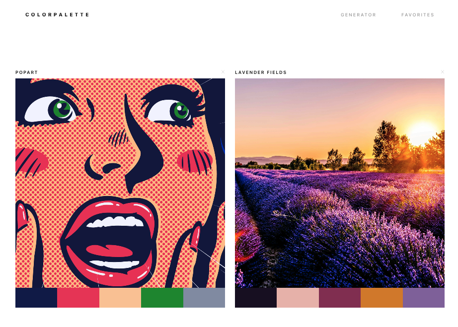

# Color Palette




A minimalist tool for designers to extract and manage aesthetic color schemes from images.

## Description

Color Palette Generator is a React application that leverages the **ColorThief** algorithm to pull dominant colors from any image URL. It features a minimalist UI, allowing users to curate a personal collection of color palettes stored in a persistent **Airtable** database.

## MVP

- **Generate:** As a user, I can paste an image URL to extract 5 distinct colors.
- **Save:** As a user, I can name and save palettes to my collection.
- **Manage:** As a user, I can view, rename, and delete saved palettes on a dedicated Favorites page.
- **Responsive:** As a user, the layout adapts to my screen size, fitting up to 5 palettes per row.

---

## Technologies Used

- **Frontend:** React.js, HTML5, CSS3 (Custom Studio Minimalist Design)
- **Backend/Database:** Airtable API
- **API Testing:** Bruno
- **Libraries:**
  - `colorthief`: For image color extraction
  - `react-router-dom`: For client-side navigation

---

## Environment Variables

To run this project, you will need to add the following variables to your `.env` file:

```text
VITE_AIRTABLE_TOKEN=your_personal_access_token
VITE_AIRTABLE_BASE_ID=your_base_id
VITE_AIRTABLE_TABLE_NAME=your_table_name
```

## Airtable Columns

Your Airtable Base should be structured with the following fields:
| Column Name | Type | Description |
| ------------- | ---------- | ---------- |
| Name | Single line text | The name given to the palette |
| ImageURL | URL | The source URL of the image |  
| Color1 | Single line text | Hex code for color 1 |
| Color2 | Single line text | Hex code for color 2 |
| Color3 | Single line text | Hex code for color 3 |
| Color4 | Single line text | Hex code for color 4 |
| Color5 | Single line text | Hex code for color 5 |

## Component Tree

**Component Hierarchy**

```text
App.jsx (Parent / Router)
├── Navbar.jsx (Navigation links)
├── GeneratorPage.jsx (State: imageUrl, colors)
│   └── PaletteDisplay.jsx (Renders: Image + ColorStrip)
└── FavoritesPage.jsx (State: savedItems)
    └── (Renders: Grid of saved Palette Cards)
```

**Routing**
| Path | Component | Description |
| ------------- | ---------- | ---------- |
| / | GeneratorPage | Home/Generator Page |
| /favorites | FavoritesPage | Saved Palettes Gallery |
